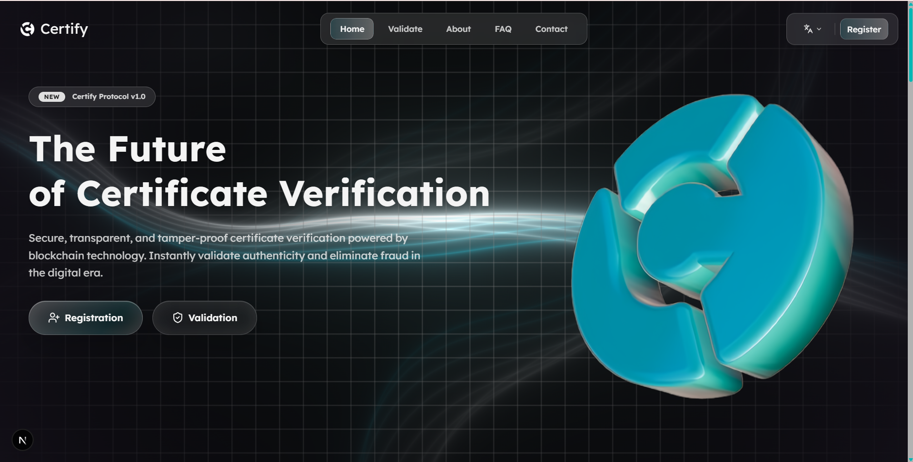

# Certify



**Certify** adalah aplikasi web blockchain-native dengan tema Web3 modern dan gaya Gen Z, dirancang untuk kompetisi dan penilaian juri. Platform ini menonjolkan tampilan visual yang segar, alur pengguna intuitif, dan pengalaman verifikasi sertifikat digital yang dapat dipercaya.

## Ringkasan Proyek

- Platform verifikasi sertifikat digital dengan fokus keamanan, transparansi, dan kecepatan.
- Built with Next.js 16, React 19, Tailwind CSS 4, dan Framer Motion.
- Menyediakan alur validasi sertifikat berupa pencarian manual, validasi QR, dan dukungan dokumen PDF.
- Dilengkapi halaman informatif: Home, Validasi, About, FAQ, Contact, Register, Terms, Privacy, dan halaman verifikasi langsung.

## Fitur Utama

1. **Verifikasi Sertifikat Instan**
   - Pencarian berdasarkan ID atau hash sertifikat.
   - Validasi QR otomatis untuk verifikasi cepat melalui perangkat mobile.
   - Pengaturan hasil validasi yang jelas antara valid dan invalid.

2. **Keamanan dan Kepercayaan**
   - Konsep tamper-proof dengan pengelolaan data berbasis blockchain.
   - Informasi status dan proof yang bisa diandalkan oleh pihak lembaga.
   - Dokumen dan metadata diverifikasi secara aman tanpa membuka data sensitif.

3. **UI/UX Kompetitif**
   - Desain modern dengan animasi halus menggunakan `framer-motion`.
   - Interaksi visual yang responsif dan cocok untuk presentasi lomba.
   - Struktur section jelas: hero, fitur, statistik, FAQ, dan kontak.

4. **Konten Informasi Lengkap**
   - Penjelasan visi proyek, manfaat penggunaan, dan mekanisme verifikasi.
   - Bagian FAQ yang komprehensif untuk menjawab pertanyaan juri.
   - Halaman kontak dengan form dukungan serta alamat email.

5. **Dukungan Multibahasa**
   - Tersedia file bahasa `en.json` dan `id.json` untuk kemudahan internasionalisasi.

## Struktur Aplikasi

- `src/app/page.js` — halaman utama yang menggabungkan komponen Home, Validation, About, FAQ, Contact.
- `src/components/home` — tampilan hero dengan ajakan register dan validate.
- `src/components/validation` — fungsi pencarian dan hasil verifikasi.
- `src/components/about` — deskripsi nilai tambah proyek dan statistik.
- `src/components/faq` — daftar pertanyaan umum dan jawaban.
- `src/components/contact` — form kontak dan informasi dukungan.
- `src/data/en.json` / `src/data/id.json` — data teks untuk bahasa Inggris dan Indonesia.
- `src/lib/utils.js` — utilitas aplikasi untuk pencarian sertifikat dan validasi.
- `src/context` — handler scroll dan konteks bahasa.

## Instalasi dan Jalankan

### Prasyarat

Sebelum menjalankan proyek ini, pastikan perangkat sudah memiliki:

- `Node.js` versi 18 atau lebih baru (direkomendasikan Node.js 20 LTS)
  - Download: https://nodejs.org/
- `npm` (sudah termasuk dalam instalasi Node.js)
- `git` untuk clone repositori
  - Download: https://git-scm.com/
- Browser modern seperti Chrome, Edge, atau Firefox
- Koneksi internet untuk mengunduh dependensi dan library

### Langkah Instalasi

1. Clone repositori:

```bash
git clone <repository-url>
cd certify
```

2. Pasang dependensi:

```bash
npm install
```

3. Jalankan mode development:

```bash
npm run dev
```

4. Buka di browser:

```
http://localhost:3000
```

## Build dan Produksi

Untuk menghasilkan versi produksi:

```bash
npm run build
npm start
```

## Teknologi yang Digunakan

- Next.js 16
- React 19
- Tailwind CSS 4
- Framer Motion
- Lucide React / Phosphor Icons
- Radix UI
- date-fns
- PDF.js (`pdfjs-dist`)
- Three.js (untuk visual atau animasi 3D pendukung)

## Petunjuk Penilaian

README ini dibuat agar mudah dinilai oleh juri dengan menekankan:

- Tujuan dan nilai proyek secara jelas.
- Fitur teknis dan keunggulan produk.
- Arsitektur source code dan komponen utama.
- Langkah instalasi sederhana untuk verifikasi cepat.

---

> Proyek ini didesain sebagai platform showcase kompetisi. Fokus pada keandalan, tampilan profesional, dan dokumentasi yang mudah dinilai oleh juri.
